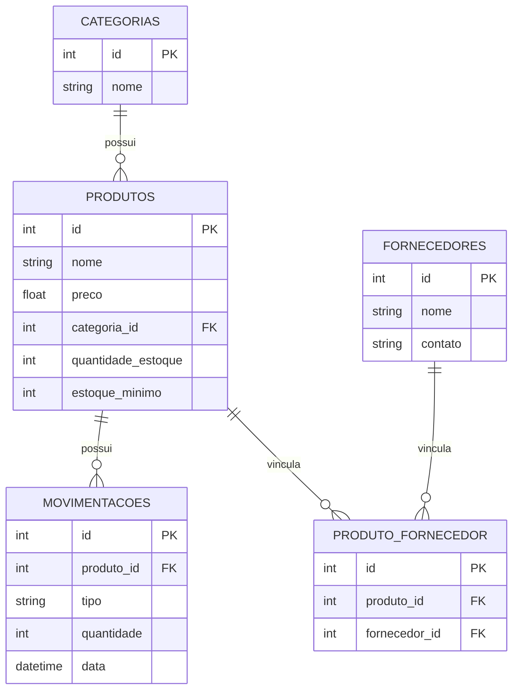

# Controle de Estoque — Sistema Full-Stack

Sistema completo de controle de estoque para uma pequena empresa, cobrindo produtos, categorias, fornecedores e movimentações de entrada/saída. Projeto-vitrine de portfólio, construído do zero para demonstrar a integração de ponta a ponta entre front-end, back-end e banco de dados.

🔗 **Aplicação ao vivo:** [controle-estoque-app-psi.vercel.app](https://controle-estoque-app-psi.vercel.app)
📄 **Documentação interativa da API:** [controle-estoque-app-tovn.onrender.com/docs](https://controle-estoque-app-tovn.onrender.com/docs)

> O back-end roda no plano gratuito do Render, que "dorme" após um período de inatividade — a primeira requisição depois de um tempo sem uso pode levar até 1 minuto para responder. A interface já avisa isso durante o carregamento.

## Sobre este projeto

Este é o quarto e último projeto de um portfólio de quatro peças, cada uma demonstrando uma competência técnica diferente:

1. **To-Do List** (Angular) — front-end puro
2. **API REST** (FastAPI) — back-end puro
3. **Modelagem de banco de dados** (SQL) — schema de controle de estoque
4. **Este projeto** — o mesmo cenário de negócio do Projeto 3, agora implementado como um sistema real e funcional, integrando front-end, back-end e persistência de ponta a ponta.

## Arquitetura

Monorepo com duas aplicações independentes, publicadas separadamente:

```
controle-estoque-app/
├── backend/    # API REST (FastAPI + SQLModel + SQLite)
└── frontend/   # Interface (Angular 19 + Signals)
```

- **Back-end** publicado no **Render** (plano gratuito).
- **Front-end** publicado na **Vercel**, consumindo a API via HTTP.
- Comunicação entre os dois configurada via CORS (back-end) e variável de ambiente `apiUrl` (front-end) — nenhuma URL fixa espalhada pelo código.

## Modelagem de Dados

Schema relacional com cinco tabelas: `categorias` e `fornecedores` como cadastros de apoio, `produtos` como entidade central, `produto_fornecedor` como tabela de associação da relação N:N entre produtos e fornecedores, e `movimentacoes` registrando o histórico de entradas/saídas de cada produto.



## Funcionalidades

- CRUD completo de produtos, categorias e fornecedores.
- Relação N:N entre produtos e fornecedores (um produto pode ter vários fornecedores, e vice-versa).
- Registro de movimentações de estoque (entrada/saída), com atualização automática da quantidade e validação contra saldo insuficiente.
- Histórico completo de movimentações por produto (rastreabilidade).
- Alerta visual de estoque baixo, com limite configurável por produto.
- Dashboard com indicadores gerais e gráficos de movimentações (últimos 30 dias) e produtos por categoria.
- Validações de negócio no back-end (preço/quantidade nunca negativos, saída nunca deixa o estoque negativo, exclusões bloqueadas quando há dependências) — nunca só na tela.
- Banco de dados populado com dados de exemplo realistas desde o primeiro acesso.
- Estados de carregamento, erro (com nova tentativa) e confirmação antes de ações destrutivas, pensados para a experiência do usuário num back-end gratuito que pode demorar a responder.

## Stack técnica

**Back-end**
- Python, FastAPI, SQLModel
- SQLite
- Deploy: Render

**Front-end**
- Angular 19 (Standalone Components + Signals)
- Tailwind CSS
- ng2-charts (Chart.js)
- Deploy: Vercel

## Rodando localmente

Requer Python 3.11+, Node 18+ e npm.

**Back-end:**
```bash
cd backend
python -m venv venv
source venv/Scripts/activate   # Windows (Git Bash) — no PowerShell: .\venv\Scripts\Activate.ps1
pip install -r requirements.txt
uvicorn app.main:app --reload
```
Sobe em `http://localhost:8000`. O banco (`estoque.db`, SQLite) é criado e populado automaticamente na primeira execução.

**Front-end** (em outro terminal):
```bash
cd frontend
npm install
npm start
```
Sobe em `http://localhost:4200`, já apontando para a API local em `http://localhost:8000` (ver `frontend/src/environments/environment.ts`).

## Licença

Projeto de portfólio pessoal, sem licença de uso definida.
